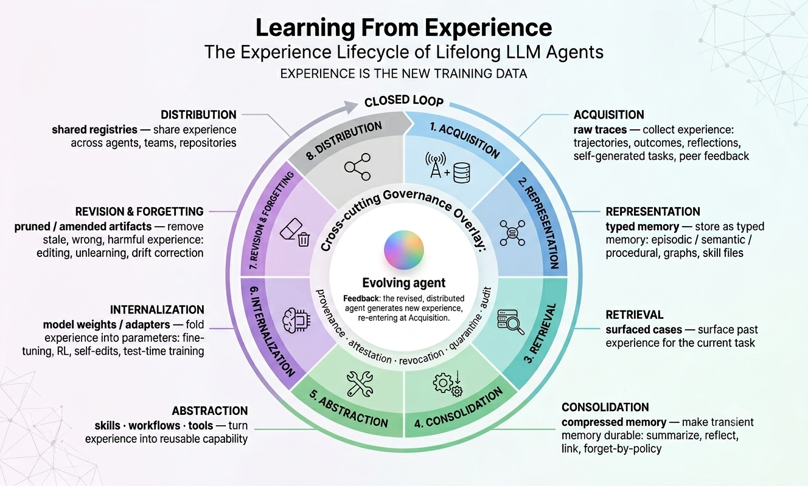
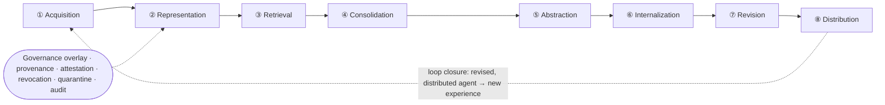

<div align="center">

# Awesome LLM-Agent Experience Lifecycle [](https://awesome.re)

### The **Experience Lifecycle** of lifelong, self-evolving & memory-augmented LLM agents

_A curated, continuously-updated reading list that follows agent **experience** end-to-end —
from raw interaction to persistent memory, abstracted skills, internalized weights, and shared knowledge._

[](#-citation)
[](CONTRIBUTING.md)
[](https://github.com/EvaxHe/Awesome-LLM-Agent-Experience-Lifecycle/stargazers)
[](https://github.com/EvaxHe/Awesome-LLM-Agent-Experience-Lifecycle/commits)
[](LICENSE)

<!-- BEGIN:STATS -->
**115 systems** across the 8 stages (8 cross-cutting) · **11 related surveys** · last verified **2026-06-03**

<sub>Per-stage counts (systems may appear under more than one stage): S1 23 · S2 14 · S3 14 · S4 18 · S5 24 · S6 43 · S7 3 · S8 32</sub>
<!-- END:STATS -->

</div>

> **TL;DR — experience is the new training data.** Pretraining learns from a fixed corpus and
> instruction tuning from human demonstrations; experience-driven agents learn from the
> trajectory-bearing interactions they generate *themselves* at deployment time. This list
> organizes that literature by the **lifecycle of an experience signal** — the path it takes
> from acquisition to persistent change — rather than by which artifact gets updated.

<!-- Replace this Mermaid placeholder with Figure 1 (the lifecycle ring) once the figure is ready:
      -->



---

## Why another list? (how this differs from existing ones)

Prior reading lists organize the field by **module** or by **what evolves**. This one follows
**experience as it flows**, which surfaces the under-served stages (Revision, Distribution) and a
cross-cutting **Governance / threat** layer that the others omit.

| Existing list | Organized by | What this list adds |
| --- | --- | --- |
| [qianlima-lab/awesome-lifelong-llm-agent](https://github.com/qianlima-lab/awesome-lifelong-llm-agent) | Module: perception / memory / action | Consolidation, Abstraction, Revision, and a Governance threat model — none of which a module view captures |
| [EvoAgentX/Awesome-Self-Evolving-Agents](https://github.com/EvoAgentX/Awesome-Self-Evolving-Agents) | What / when / how to evolve | The flow *between* stages, the under-served right end (Revision S7, Distribution S8), and the EPTM threat model |
| [TsinghuaC3I/Awesome-Memory-for-Agents](https://github.com/TsinghuaC3I/Awesome-Memory-for-Agents) | Memory only | Memory → skill → weights treated as one pipeline, not memory in isolation |

---

## Contents

- [The eight stages](#the-eight-stages)
  - [S1 — Acquisition](#s1) · [S2 — Representation](#s2) · [S3 — Retrieval & Use](#s3) · [S4 — Consolidation](#s4)
  - [S5 — Abstraction](#s5) · [S6 — Internalization](#s6) · [S7 — Revision & Forgetting](#s7) · [S8 — Distribution](#s8)
- [Cross-cutting frameworks](#cross-cutting-frameworks)
- [Governance & the Experience-Pipeline Threat Model (EPTM)](#-governance--the-experience-pipeline-threat-model-eptm)
- [Routing: where should an experience signal live?](#-routing-where-should-an-experience-signal-live)
- [Evaluating change over time](#-evaluating-change-over-time)
- [Related surveys](#-related-surveys)
- [Framing & position pieces](#framing--position-pieces)
- [Open problems](#-open-problems)
- [Citation](#-citation) · [Contributing](#-contributing) · [Star history](#-star-history)

---

## The eight stages

> Each paper appears under **every stage it touches** (so the same system can show up in more than
> one table — exactly how the survey reads it). Systems spanning ≥5 stages are gathered under
> [Cross-cutting frameworks](#cross-cutting-frameworks). Tables are generated from
> [`data/literature_matrix.csv`](data/literature_matrix.csv); **edit the CSV, not this file.**

<!-- BEGIN:STAGES -->
### <a id="s1"></a>S1 — Acquisition  ·  `23 systems`

> What experience is collected — trajectories, outcomes, reflections, self-generated tasks, peer feedback, pseudo-labels.

| Year | Title | Venue | What's updated | Key contribution | Code |
| :---: | --- | --- | --- | --- | :---: |
| 2026 | [GeoEvolver: Experience-Driven Multi-Agent Earth Observation](https://arxiv.org/html/2602.02559) | arXiv 2602.02559 | Memory + tools | Domain-specific multi-agent experience |  |
| 2025 | [A Self-Evolving GUI Agent Learning via Failed Experience](https://arxiv.org/html/2603.24533) | arXiv 2603.24533 | Weights | Learning from failure |  |
| 2025 | [Abductive Reasoning Path Synthesis for Training RAG Agents](https://arxiv.org/html/2509.23071v1) | arXiv 2509.23071 | Weights | Process-level supervision |  |
| 2025 | Absolute Zero: Reasoner with Zero Data | arXiv | Weights | Zero-human-data RL training |  |
| 2025 | [AgentEvolver: Towards Efficient Self-Evolving Agent System](https://github.com/modelscope/AgentEvolver) | GitHub | Weights | Self-evolution framework | [](https://github.com/modelscope/AgentEvolver) |
| 2025 | [Automating Agent Creation via Agent Debate](https://arxiv.org/html/2503.23781v1) | arXiv 2503.23781 | Workflow | Debate-driven workflow generation |  |
| 2025 | [Hindsight Experience Replay for LLM Agent Trajectory Relabeling](https://arxiv.org/abs/2603.21357v1) | arXiv 2603.21357 | Replay buffer | Goal relabeling for LM agents |  |
| 2025 | Multi-Agent Evolve (MAE) | arXiv | Weights | Co-evolution dynamics |  |
| 2025 | [Optimizing Multi-Agent RAG through Self-Training](https://arxiv.org/html/2506.10844) | arXiv 2506.10844 | Weights | Self-training MA-RAG |  |
| 2025 | Play2Prompt: Zero-Shot Tool Discovery | arXiv | Prompt + memory | Discover tools without docs |  |
| 2025 | [SEAL: Self-Adapting Language Models](https://arxiv.org/html/2506.10943v1) | arXiv 2506.10943 | Weights | Persistent self-edits via RL | [](https://github.com/Continual-Intelligence/SEAL) |
| 2025 | [SEAL: Synergistic Co-Evolution of Agents and Learning Environments](https://huggingface.co/papers/2605.24426) | HuggingFace papers 2605.24426 | Policy + environment | Curriculum co-evolution |  |
| 2025 | Self-Questioning Agents (AgentEvolver self-questioning component) | arXiv | Tasks | Self-generated curricula |  |
| 2025 | Self-Taught Evaluators | arXiv | Weights | Match GPT-4 as judge |  |
| 2025 | [Synthesizing Agent Trajectories via Test-Time Exploration under Validate-by-Reproduce](https://arxiv.org/html/2510.00415v1) | arXiv 2510.00415 | External + weights | Synthetic trajectories |  |
| 2025 | TTRL: Test-Time Reinforcement Learning | arXiv | Weights at test time | Test-time RL surpassing own supervision ceiling |  |
| 2024 | [ECHO: Sample-Efficient Online Learning in LM Agents via Hindsight Trajectory Rewriting](https://arxiv.org/html/2510.10304v1) | arXiv 2510.10304 | External demonstration store + ICL | HER-for-LM-agents formulation |  |
| 2023 | [ExpeL: LLM Agents Are Experiential Learners](https://arxiv.org/abs/2308.10144) | arXiv 2308.10144 | External insight library | Insight extraction across tasks | [](https://github.com/LeapLabTHU/ExpeL) |
| 2023 | ReAct: Synergizing Reasoning and Acting | ICLR | Prompt | ReAct paradigm |  |
| 2023 | [Reflexion: Language Agents with Verbal Reinforcement Learning](https://arxiv.org/abs/2303.11366) | NeurIPS 2023 | External episodic notes | Verbal RL substitute for parameter updates |  |
| 2023 | Toolformer | NeurIPS | Weights | Self-supervised tool learning |  |
| 2019 | Experience Replay for Continual Learning | NeurIPS | Weights | Replay for continual learning |  |
| 2017 | Mastering the Game of Go without Human Knowledge | Nature | Weights | Self-play to superhuman |  |

### <a id="s2"></a>S2 — Representation  ·  `14 systems`

> How collected experience is stored — typed records, graph notes, skill files, workflow graphs, tool descriptors, parametric encodings.

| Year | Title | Venue | What's updated | Key contribution | Code |
| :---: | --- | --- | --- | --- | :---: |
| 2025 | A-MEM: Zettelkasten-Inspired Self-Organizing Memory for LLM Agents | arXiv | External memory | Self-organizing memory |  |
| 2025 | [Beyond One-Shot Diagnosis with Agents That Remember Reflect and Improve](https://arxiv.org/html/2604.14475v1) | arXiv 2604.14475 | Memory | Memory-reflective med agent |  |
| 2025 | [ENGRAM: Lightweight Memory Orchestration for Conversational Agents](https://arxiv.org/html/2511.12960v1) | arXiv 2511.12960 | External memory | Lightweight typed memory router |  |
| 2025 | [Episodic-Semantic Memory Architecture for Long-Horizon Scientific Agents](https://arxiv.org/html/2605.17625v1) | arXiv 2605.17625 | External memory | Episodic+semantic split for science |  |
| 2025 | [Get Experience from Practice: AgentRR (Record & Replay)](https://arxiv.org/abs/2505.17716) | arXiv 2505.17716 | External record | Record-replay paradigm |  |
| 2025 | Large Memory Models LM2 | arXiv | Architecture + memory | +37% over recurrent memory transformers |  |
| 2025 | [MaRS: A Cognitive Memory Architecture and Benchmark for Privacy-Aware Generative Agents](https://arxiv.org/html/2512.12856v1) | arXiv 2512.12856 | External memory + provenance | Privacy + provenance + retention schema |  |
| 2025 | Mem0/Mem0g: Production-grade memory for agents | arXiv | External memory | 91% latency reduction |  |
| 2025 | MemInsight: Structured Memory Augmentation for Agents | arXiv | External memory | +34% recall over RAG |  |
| 2025 | MemOS: An Operating System for Memory | arXiv | External memory | Memory OS abstraction |  |
| 2025 | [Procedural Memory Is Not All You Need](https://arxiv.org/abs/2505.03434) | arXiv 2505.03434 | Memory | Argues against pure procedural memory |  |
| 2025 | ToolGen: Tools as Tokens | arXiv | Vocabulary | Vocabulary-level tool fusion |  |
| 2023 | [Generative Agents: Interactive Simulacra of Human Behavior](https://dl.acm.org/doi/10.1145/3586183.3606763) | UIST 2023 | External memory stream | Architecture: memory stream + reflection + planning |  |
| 2023 | [Reflexion: Language Agents with Verbal Reinforcement Learning](https://arxiv.org/abs/2303.11366) | NeurIPS 2023 | External episodic notes | Verbal RL substitute for parameter updates |  |

### <a id="s3"></a>S3 — Retrieval & Use  ·  `14 systems`

> How stored experience is surfaced for the current task — similarity, attribute, learned, hierarchical, and hindsight-conditioned retrieval.

| Year | Title | Venue | What's updated | Key contribution | Code |
| :---: | --- | --- | --- | --- | :---: |
| 2026 | [Learning to Retrieve from Agent Trajectories](https://arxiv.org/html/2604.04949v1) | arXiv 2604.04949 | Retriever weights | Trajectory-aware retrieval |  |
| 2026 | [Trajectory-Informed Memory Generation for Self-Improving Agent Systems](https://arxiv.org/html/2603.10600) | arXiv 2603.10600 | External tip memory | Sub-task vs task-level memory comparison |  |
| 2025 | Chain-of-Tools: Frozen LLM with Tool Retrieval | arXiv | External tool retriever | Frozen LM with retrieval |  |
| 2025 | [ENGRAM: Lightweight Memory Orchestration for Conversational Agents](https://arxiv.org/html/2511.12960v1) | arXiv 2511.12960 | External memory | Lightweight typed memory router |  |
| 2025 | [GAE-Retriever / WebRAGent: RAG for Multimodal Web Agent Planning](https://openreview.net/forum?id=L1VPZFbAcu) | OpenReview | External + ICL | +15% gain via retrieved knowledge |  |
| 2025 | [Get Experience from Practice: AgentRR (Record & Replay)](https://arxiv.org/abs/2505.17716) | arXiv 2505.17716 | External record | Record-replay paradigm |  |
| 2025 | MemInsight: Structured Memory Augmentation for Agents | arXiv | External memory | +34% recall over RAG |  |
| 2024 | [Continual Learning of Multimodal Agents by Transforming Trajectories into Actionable Insights](https://arxiv.org/abs/2406.14596v1) | arXiv 2406.14596 | External insights | Trajectory-to-insight pipeline |  |
| 2024 | [RAHL: Retrieval-Augmented Hierarchical In-Context RL](https://arxiv.org/abs/2408.06520) | arXiv 2408.06520 | ICL + retrieval | 9-42% improvement via retrieval |  |
| 2024 | [REGENT: A Retrieval-Augmented Generalist Agent That Can Act In-Context](https://arxiv.org/abs/2412.04759) | arXiv 2412.04759 | External + ICL | 3x fewer parameters via retrieval |  |
| 2023 | [Generative Agents: Interactive Simulacra of Human Behavior](https://dl.acm.org/doi/10.1145/3586183.3606763) | UIST 2023 | External memory stream | Architecture: memory stream + reflection + planning |  |
| 2023 | ReAct: Synergizing Reasoning and Acting | ICLR | Prompt | ReAct paradigm |  |
| 2023 | [Reflexion: Language Agents with Verbal Reinforcement Learning](https://arxiv.org/abs/2303.11366) | NeurIPS 2023 | External episodic notes | Verbal RL substitute for parameter updates |  |
| 2020 | Retrieval-Augmented Generation | NeurIPS | External + ICL | Foundational RAG |  |

### <a id="s4"></a>S4 — Consolidation  ·  `18 systems`

> How transient memories become durable — summarization, reflection, salience scoring, note-linking, RL-driven consolidation, compression.

| Year | Title | Venue | What's updated | Key contribution | Code |
| :---: | --- | --- | --- | --- | :---: |
| 2026 | CoWork-X: Experience-Optimized Multi-Agent Co-Evolution | arXiv | Memory + weights | Fast-slow co-evolution |  |
| 2026 | [Self-Evolving Deep Research Agents via Test-Time Rubric-Guided Verification](https://arxiv.org/abs/2601.15808) | arXiv 2601.15808 | Memory + prompts | Plug-and-play test-time self-evolution |  |
| 2026 | [Trajectory-Informed Memory Generation for Self-Improving Agent Systems](https://arxiv.org/html/2603.10600) | arXiv 2603.10600 | External tip memory | Sub-task vs task-level memory comparison |  |
| 2025 | [A Self-Optimizing Agent with Dynamic Hierarchical Workflow](https://arxiv.org/html/2508.02959) | arXiv 2508.02959 | Workflow | Workflow self-optimization |  |
| 2025 | A-MEM: Zettelkasten-Inspired Self-Organizing Memory for LLM Agents | arXiv | External memory | Self-organizing memory |  |
| 2025 | [Beyond One-Shot Diagnosis with Agents That Remember Reflect and Improve](https://arxiv.org/html/2604.14475v1) | arXiv 2604.14475 | Memory | Memory-reflective med agent |  |
| 2025 | [Episodic-Semantic Memory Architecture for Long-Horizon Scientific Agents](https://arxiv.org/html/2605.17625v1) | arXiv 2605.17625 | External memory | Episodic+semantic split for science |  |
| 2025 | [Experiential Reflective Learning for Self-Improving LLM Agents (ERL)](https://arxiv.org/html/2603.24639) | arXiv 2603.24639 | External heuristic store | Lightweight task adaptation via heuristics |  |
| 2025 | [Internalizing Agency from Reflective Experience](https://arxiv.org/html/2603.16843v1) | arXiv 2603.16843 | Weights + memory | Reflection-driven internalization |  |
| 2025 | LightThinker: Reasoning Compression | arXiv | Memory | 70% memory reduction |  |
| 2025 | MEM1: RL-Trained Memory Consolidation | arXiv | External memory | 3.7× less memory; 1.78× faster |  |
| 2025 | Meta-Reflexion | arXiv | External meta-memory | Hierarchical reflection |  |
| 2024 | [Continual Learning of Multimodal Agents by Transforming Trajectories into Actionable Insights](https://arxiv.org/abs/2406.14596v1) | arXiv 2406.14596 | External insights | Trajectory-to-insight pipeline |  |
| 2024 | [ECHO: Sample-Efficient Online Learning in LM Agents via Hindsight Trajectory Rewriting](https://arxiv.org/html/2510.10304v1) | arXiv 2510.10304 | External demonstration store + ICL | HER-for-LM-agents formulation |  |
| 2024 | [RAHL: Retrieval-Augmented Hierarchical In-Context RL](https://arxiv.org/abs/2408.06520) | arXiv 2408.06520 | ICL + retrieval | 9-42% improvement via retrieval |  |
| 2023 | [ExpeL: LLM Agents Are Experiential Learners](https://arxiv.org/abs/2308.10144) | arXiv 2308.10144 | External insight library | Insight extraction across tasks | [](https://github.com/LeapLabTHU/ExpeL) |
| 2023 | [Generative Agents: Interactive Simulacra of Human Behavior](https://dl.acm.org/doi/10.1145/3586183.3606763) | UIST 2023 | External memory stream | Architecture: memory stream + reflection + planning |  |
| 2023 | [Reflexion: Language Agents with Verbal Reinforcement Learning](https://arxiv.org/abs/2303.11366) | NeurIPS 2023 | External episodic notes | Verbal RL substitute for parameter updates |  |

### <a id="s5"></a>S5 — Abstraction  ·  `24 systems`

> How experience becomes reusable capability — skills, heuristics, procedural templates, workflows, tools.

| Year | Title | Venue | What's updated | Key contribution | Code |
| :---: | --- | --- | --- | --- | :---: |
| 2026 | EvoTool | arXiv | Tool registry | Tools-from-experience |  |
| 2026 | FactorMiner | arXiv | External factor library | Reusable factor abstraction |  |
| 2026 | [GeoEvolver: Experience-Driven Multi-Agent Earth Observation](https://arxiv.org/html/2602.02559) | arXiv 2602.02559 | Memory + tools | Domain-specific multi-agent experience |  |
| 2026 | The Single-Multi Evolution Loop | arXiv | Weights | Single-multi loop |  |
| 2026 | [Trajectory-Informed Memory Generation for Self-Improving Agent Systems](https://arxiv.org/html/2603.10600) | arXiv 2603.10600 | External tip memory | Sub-task vs task-level memory comparison |  |
| 2026 | [Unified Evolution of Skill-Augmented Agents via RL](https://arxiv.org/html/2605.06130v3) | arXiv 2605.06130 | Skills + weights | Skill+RL unified |  |
| 2025 | [A Self-Optimizing Agent with Dynamic Hierarchical Workflow](https://arxiv.org/html/2508.02959) | arXiv 2508.02959 | Workflow | Workflow self-optimization |  |
| 2025 | A-MEM: Zettelkasten-Inspired Self-Organizing Memory for LLM Agents | arXiv | External memory | Self-organizing memory |  |
| 2025 | [AdaptFlow: Adaptive Workflow Optimization via Meta-Learning](https://arxiv.org/html/2508.08053) | arXiv 2508.08053 | Workflow | Generalizable workflow init |  |
| 2025 | AFlow: MCTS over Code-Represented Workflows | arXiv | Workflow graph | 5.7% over manual workflows |  |
| 2025 | [AgentEvolver: Towards Efficient Self-Evolving Agent System](https://github.com/modelscope/AgentEvolver) | GitHub | Weights | Self-evolution framework | [](https://github.com/modelscope/AgentEvolver) |
| 2025 | Alita: Autonomous MCP Construction | arXiv | Tool registry | Autonomous tool creation |  |
| 2025 | [Automating Agent Creation via Agent Debate](https://arxiv.org/html/2503.23781v1) | arXiv 2503.23781 | Workflow | Debate-driven workflow generation |  |
| 2025 | [Beyond One-Shot Diagnosis with Agents That Remember Reflect and Improve](https://arxiv.org/html/2604.14475v1) | arXiv 2604.14475 | Memory | Memory-reflective med agent |  |
| 2025 | [Experiential Reflective Learning for Self-Improving LLM Agents (ERL)](https://arxiv.org/html/2603.24639) | arXiv 2603.24639 | External heuristic store | Lightweight task adaptation via heuristics |  |
| 2025 | [Hermes Agent: Persistent Skills for Personal AI](https://www.turingpost.com/p/hermes) | Industry blog | Skill files | Persistent personal-agent skills |  |
| 2025 | [Internalizing Agency from Reflective Experience](https://arxiv.org/html/2603.16843v1) | arXiv 2603.16843 | Weights + memory | Reflection-driven internalization |  |
| 2025 | LIMO: Less Is More for Reasoning | arXiv | Weights | 817 trajectories unlock reasoning |  |
| 2025 | MaAS: Agentic Supernet | arXiv | Architecture | 6-45% cost of baselines |  |
| 2025 | [OpenClaw Agent Skills (SKILL.md)](https://skywork.ai/blog/ai-bot/claude-example-skills-library-ultimate-guide/) | Industry blog | Skill files | Modular skill library |  |
| 2025 | Play2Prompt: Zero-Shot Tool Discovery | arXiv | Prompt + memory | Discover tools without docs |  |
| 2025 | Reinforcement-Learned Teachers | arXiv | Teacher weights | Teacher quality decoupled from solver capability |  |
| 2024 | [Continual Learning of Multimodal Agents by Transforming Trajectories into Actionable Insights](https://arxiv.org/abs/2406.14596v1) | arXiv 2406.14596 | External insights | Trajectory-to-insight pipeline |  |
| 2023 | [ExpeL: LLM Agents Are Experiential Learners](https://arxiv.org/abs/2308.10144) | arXiv 2308.10144 | External insight library | Insight extraction across tasks | [](https://github.com/LeapLabTHU/ExpeL) |

### <a id="s6"></a>S6 — Internalization  ·  `43 systems`

> How experience becomes parameters — trajectory-SFT, RL with verifiable rewards, self-edits, test-time training, adapter selection, distillation.

| Year | Title | Venue | What's updated | Key contribution | Code |
| :---: | --- | --- | --- | --- | :---: |
| 2026 | [Adaptive Compute Allocation for Code Generation via Test-Time Training](https://arxiv.org/html/2601.00894) | arXiv 2601.00894 | Weights | Training-free gating for TTT |  |
| 2026 | CoWork-X: Experience-Optimized Multi-Agent Co-Evolution | arXiv | Memory + weights | Fast-slow co-evolution |  |
| 2026 | [SECL: Self-Calibrating LMs via Test-Time Discriminative Distillation](https://arxiv.org/abs/2604.09624) | arXiv 2604.09624 | Weights | Selective test-time adaptation |  |
| 2026 | [Self-Evolving Deep Research Agents via Test-Time Rubric-Guided Verification](https://arxiv.org/abs/2601.15808) | arXiv 2601.15808 | Memory + prompts | Plug-and-play test-time self-evolution |  |
| 2026 | The Single-Multi Evolution Loop | arXiv | Weights | Single-multi loop |  |
| 2026 | [Unified Evolution of Skill-Augmented Agents via RL](https://arxiv.org/html/2605.06130v3) | arXiv 2605.06130 | Skills + weights | Skill+RL unified |  |
| 2026 | [What Do Agents Learn from Trajectory-SFT (PIPE)](https://arxiv.org/html/2602.01611v1) | arXiv 2602.01611 | Weights | Trajectory-SFT amplifies interface shortcutting |  |
| 2025 | [A Self-Evolving GUI Agent Learning via Failed Experience](https://arxiv.org/html/2603.24533) | arXiv 2603.24533 | Weights | Learning from failure |  |
| 2025 | [Abductive Reasoning Path Synthesis for Training RAG Agents](https://arxiv.org/html/2509.23071v1) | arXiv 2509.23071 | Weights | Process-level supervision |  |
| 2025 | Absolute Zero: Reasoner with Zero Data | arXiv | Weights | Zero-human-data RL training |  |
| 2025 | [AdaptFlow: Adaptive Workflow Optimization via Meta-Learning](https://arxiv.org/html/2508.08053) | arXiv 2508.08053 | Workflow | Generalizable workflow init |  |
| 2025 | AFlow: MCTS over Code-Represented Workflows | arXiv | Workflow graph | 5.7% over manual workflows |  |
| 2025 | [AgentEvolver: Towards Efficient Self-Evolving Agent System](https://github.com/modelscope/AgentEvolver) | GitHub | Weights | Self-evolution framework | [](https://github.com/modelscope/AgentEvolver) |
| 2025 | DeepSeek-R1 | arXiv | Weights | Pure RL produces strong reasoning |  |
| 2025 | GRPO: Group Relative Policy Optimization | arXiv | Weights | Practical RL algorithm |  |
| 2025 | [Hindsight Experience Replay for LLM Agent Trajectory Relabeling](https://arxiv.org/abs/2603.21357v1) | arXiv 2603.21357 | Replay buffer | Goal relabeling for LM agents |  |
| 2025 | [Internalizing Agency from Reflective Experience](https://arxiv.org/html/2603.16843v1) | arXiv 2603.16843 | Weights + memory | Reflection-driven internalization |  |
| 2025 | LIMO: Less Is More for Reasoning | arXiv | Weights | 817 trajectories unlock reasoning |  |
| 2025 | Multi-Agent Evolve (MAE) | arXiv | Weights | Co-evolution dynamics |  |
| 2025 | Nemotron Tool-N1 | arXiv | Weights | Outperforms GPT-4o on tool-use |  |
| 2025 | Open-Reasoner-Zero | arXiv | Weights | 1/30 training steps of R1-Zero |  |
| 2025 | [OpenHands trajectories with Qwen3-Coder](https://nebius.com/blog/posts/openhands-trajectories-with-qwen3-coder-480b) | Industry blog | Weights | Production RFT recipe |  |
| 2025 | Optima: Multi-Agent RL for Communication Efficiency | arXiv | Weights | 2.8x performance with <10% tokens |  |
| 2025 | [Optimizing Multi-Agent RAG through Self-Training](https://arxiv.org/html/2506.10844) | arXiv 2506.10844 | Weights | Self-training MA-RAG |  |
| 2025 | QwenLong-L1: Progressive Context Scaling | arXiv | Weights + context | Scaling to 120K tokens |  |
| 2025 | Reinforcement-Learned Teachers | arXiv | Teacher weights | Teacher quality decoupled from solver capability |  |
| 2025 | RL for Search-Efficient LLMs | arXiv | Weights | Learn when to search |  |
| 2025 | [SEAL: Self-Adapting Language Models](https://arxiv.org/html/2506.10943v1) | arXiv 2506.10943 | Weights | Persistent self-edits via RL | [](https://github.com/Continual-Intelligence/SEAL) |
| 2025 | [SEAL: Synergistic Co-Evolution of Agents and Learning Environments](https://huggingface.co/papers/2605.24426) | HuggingFace papers 2605.24426 | Policy + environment | Curriculum co-evolution |  |
| 2025 | Self-Taught Evaluators | arXiv | Weights | Match GPT-4 as judge |  |
| 2025 | [Synthesizing Agent Trajectories via Test-Time Exploration under Validate-by-Reproduce](https://arxiv.org/html/2510.00415v1) | arXiv 2510.00415 | External + weights | Synthetic trajectories |  |
| 2025 | [Test-Time Learning for Large Language Models](https://arxiv.org/abs/2505.20633) | arXiv 2505.20633 | Weights | Self-supervised TTT |  |
| 2025 | Text-to-LoRA | arXiv | Adapter weights | Generated adapters |  |
| 2025 | [The Surprising Effectiveness of Test-Time Training for Few-Shot Learning](https://icml.cc/virtual/2025/poster/44773) | ICML 2025 | Weights at test time | TTT works for LM few-shot |  |
| 2025 | [Trajectory Balance with Asynchrony (TBA)](https://arxiv.org/html/2503.18929v1) | arXiv 2503.18929 | Weights | Scalable replay-buffer RL |  |
| 2025 | Transformer²: Self-Adaptive LLMs | arXiv | Architecture (expert routing) | Architectural runtime adaptation |  |
| 2025 | TTRL: Test-Time Reinforcement Learning | arXiv | Weights at test time | Test-time RL surpassing own supervision ceiling |  |
| 2025 | ZeroSearch | arXiv | Weights | RL without real search |  |
| 2024 | [ECHO: Sample-Efficient Online Learning in LM Agents via Hindsight Trajectory Rewriting](https://arxiv.org/html/2510.10304v1) | arXiv 2510.10304 | External demonstration store + ICL | HER-for-LM-agents formulation |  |
| 2023 | Toolformer | NeurIPS | Weights | Self-supervised tool learning |  |
| 2022 | LoRA: Low-Rank Adaptation of Large Language Models | ICLR | Weights | Foundational PEFT |  |
| 2022 | RLHF: Training Language Models to Follow Instructions with Human Feedback | NeurIPS | Weights | Foundational RLHF |  |
| 2017 | Mastering the Game of Go without Human Knowledge | Nature | Weights | Self-play to superhuman |  |

### <a id="s7"></a>S7 — Revision & Forgetting  ·  `3 systems`

> How stale, wrong, or harmful experience is removed — memory editing, unlearning, drift correction.

| Year | Title | Venue | What's updated | Key contribution | Code |
| :---: | --- | --- | --- | --- | :---: |
| 2025 | MemOS: An Operating System for Memory | arXiv | External memory | Memory OS abstraction |  |
| 2019 | Experience Replay for Continual Learning | NeurIPS | Weights | Replay for continual learning |  |
| 1989 | Catastrophic Interference in Connectionist Networks | Psychology of Learning | Weights | Foundational forgetting |  |

### <a id="s8"></a>S8 — Distribution  ·  `32 systems`

> How experience moves across agents, users, teams, and repositories — multi-agent sharing, federated pools, protocols, skill registries.

| Year | Title | Venue | What's updated | Key contribution | Code |
| :---: | --- | --- | --- | --- | :---: |
| 2026 | [Benchmarking Language Agents Under Controllable and Extreme Context Growth](https://arxiv.org/html/2602.07962) | arXiv 2602.07962 | Evaluation | Tests context-management |  |
| 2026 | [Benchmarking LLM Agent Test-time Learning with Self-Evolving Memory](https://arxiv.org/abs/2511.20857) | arXiv 2511.20857 | Evaluation | Test-time learning + memory benchmark |  |
| 2026 | [Characterizing an Emergent Learning Community at Scale](https://arxiv.org/html/2602.18832v1) | arXiv 2602.18832 | Mixed | 2.8M agents in 3 weeks |  |
| 2026 | CoWork-X: Experience-Optimized Multi-Agent Co-Evolution | arXiv | Memory + weights | Fast-slow co-evolution |  |
| 2026 | EvoTool | arXiv | Tool registry | Tools-from-experience |  |
| 2026 | [Privacy-Preserving Multi-Agent Memory with Bayesian Trust Defense](https://arxiv.org/html/2603.02240v1) | arXiv 2603.02240 | Memory | Privacy-preserving multi-agent memory |  |
| 2026 | The Single-Multi Evolution Loop | arXiv | Weights | Single-multi loop |  |
| 2025 | AgentRxiv: Parallel AI Research Labs | arXiv | Memory + skills | +13.7% via shared research |  |
| 2025 | Alita: Autonomous MCP Construction | arXiv | Tool registry | Autonomous tool creation |  |
| 2025 | [Continuous Benchmark Generation for Enterprise LLM Agents](https://arxiv.org/html/2511.10049v1) | arXiv 2511.10049 | Evaluation | Continuous benchmark generation |  |
| 2025 | [Evaluating LLM Agents on Long-Horizon Office Workflows](https://arxiv.org/abs/2508.09124) | arXiv 2508.09124 | Evaluation | Long-horizon office benchmark |  |
| 2025 | Forecasting Rare LLM Behaviors | arXiv | N/A | Forecasting rare behaviors |  |
| 2025 | [From Secure Agentic AI to Secure Agentic Web](https://arxiv.org/html/2603.01564v1) | arXiv 2603.01564 | Mixed | Security framework |  |
| 2025 | [Hermes Agent: Persistent Skills for Personal AI](https://www.turingpost.com/p/hermes) | Industry blog | Skill files | Persistent personal-agent skills |  |
| 2025 | Leaky Thoughts: Reasoning Traces Leak Private Data | arXiv | Trace | Reasoning traces leak data |  |
| 2025 | [LifelongAgentBench: Evaluating LLM Agents as Lifelong Learners](https://openreview.net/forum?id=MYqAKKsjF9) | arXiv 2505.11942 OpenReview | Evaluation | First lifelong-agent benchmark |  |
| 2025 | [MaRS: A Cognitive Memory Architecture and Benchmark for Privacy-Aware Generative Agents](https://arxiv.org/html/2512.12856v1) | arXiv 2512.12856 | External memory + provenance | Privacy + provenance + retention schema |  |
| 2025 | [MINJA: Memory Injection Attack](https://arxiv.org/html/2601.05504v1) | arXiv 2601.05504 | Memory | >95% injection success |  |
| 2025 | [Multi-Agent Continual Evaluation Network MACEval](https://arxiv.org/html/2511.09139) | arXiv 2511.09139 | Evaluation | Multi-agent continual evaluation | [](https://github.com/zijianchen98/MACEval) |
| 2025 | Multi-Agent Evolve (MAE) | arXiv | Weights | Co-evolution dynamics |  |
| 2025 | Optima: Multi-Agent RL for Communication Efficiency | arXiv | Weights | 2.8x performance with <10% tokens |  |
| 2025 | [Persistent Compromise of LLM Agents via Poisoned Experience Retrieval](https://arxiv.org/html/2512.16962) | arXiv 2512.16962 | Experience store | Persistent compromise via retrieval |  |
| 2025 | Self-Taught Evaluators | arXiv | Weights | Match GPT-4 as judge |  |
| 2025 | SHADE-Arena: Saboteur vs. Monitor | arXiv | Evaluation | 27% undetected sabotage |  |
| 2025 | [Sleeper Memory Poisoning in LLM Agents](https://arxiv.org/abs/2605.15338) | arXiv 2605.15338 | Memory | 60-89% attack success on retrieved memories |  |
| 2025 | [Weaponizing Agent Memory for Data Exfiltration](https://arxiv.org/html/2605.01970v2) | arXiv 2605.01970 | Memory | Memory as exfil channel |  |
| 2025 | [When Memory Poisoning Looks Like Model Failure in Agentic AI](https://arxiv.org/abs/2605.22842) | arXiv 2605.22842 | Memory | 87.5% causal entry detection accuracy |  |
| 2024 | BABILong | arXiv | Evaluation | BABILong benchmark |  |
| 2024 | [Dynamic Conversational Benchmarking](https://arxiv.org/html/2409.20222v1) | arXiv 2409.20222 | Evaluation | Highlights LTM benefit |  |
| 2024 | LOCOMO: Long Conversational Memory Benchmark | arXiv | Evaluation | LOCOMO benchmark |  |
| 2016 | Emergent Communication in Multi-Agent RL | NeurIPS | Weights | Emergent communication |  |

<!-- END:STAGES -->

## Cross-cutting frameworks

> Systems whose experience pipeline spans most of the lifecycle (≥5 stages) — closed-loop
> self-evolving agents and broad frameworks.

<!-- BEGIN:CROSSCUT -->
- [Agent Evolving Learning for Open-Ended Environments](https://arxiv.org/html/2604.21725v1) — *Open-ended evolutionary learning* <sub>(S1, S2, S3, S4, S5)</sub>
- [Continual Learning for Coding Agents](https://arxiv.org/html/2507.00014) — *Continual coding* <sub>(S1, S2, S3, S4, S5, S6, S7)</sub>
- [End-to-End Optimization of Experience-Driven Self-Evolving Capability within Agents](https://arxiv.org/abs/2605.10663) — *End-to-end self-evolution* <sub>(S1, S2, S3, S4, S5, S6)</sub>
- [EvolveR: Self-Evolving LLM Agents through an Experience-Driven Lifecycle](https://arxiv.org/abs/2510.16079) — *Explicit experience-driven lifecycle* <sub>(S1, S2, S3, S4, S5, S6)</sub>
- [Self-Evolving Agent via Experience-Driven Lifelong Learning (ELL-StuLife)](https://github.com/ECNU-ICALK/ELL-StuLife) — *Lifelong agent dataset* <sub>(S1, S2, S3, S4, S5, S6, S7, S8)</sub>
- [Self-Evolving LLM Agents for Strategic Planning](https://arxiv.org/html/2506.04651) — *Long-horizon strategic eval* <sub>(S1, S2, S3, S4, S5, S6, S7, S8)</sub>
- [Voyager: An Open-Ended Embodied Agent with Large Language Models](https://arxiv.org/abs/2305.16291) — *First lifelong agent with reusable skill library* <sub>(S1, S2, S3, S4, S5)</sub>
<!-- END:CROSSCUT -->

---

## 🛡 Governance & the Experience-Pipeline Threat Model (EPTM)

Once experience **persists and accumulates**, the agent gains an attack surface a stateless model
does not have. Governance is treated as a **cross-cutting overlay** — five primitives (provenance,
attestation, revocation, quarantine, audit) that operate on the artifact produced at *every* stage.
The **EPTM** maps each persistence attack to the stage it hits, the artifact it compromises, and the
governance primitive that defends it.

| Attack target | Stage | Mechanism | Artifact compromised | Defense (primitive) |
| --- | --- | --- | --- | --- |
| Memory store | S2 | Benign-looking ingestion artifacts injected at write time (MINJA) | Stored memory entries | Counterfactual Composition Testing (audit + provenance) |
| Memory (latent) | S2→S4→S7 | Long-dormant injection that activates on a future trigger (Sleeper Memory) | Consolidated memory surviving summarization | Provenance + replay-based revocation |
| Retrieval pipeline | S3 | Malicious procedure templates persisted alongside benign experience (MemoryGraft) | Retrievable experience cases | Bayesian trust attestation |
| Retrieval pipeline | S3 | Crafted queries pull another user's stored data | Cross-user memory entries | Privacy-preserving MA memory + audit |
| Reasoning trace | S1→S3 | Sensitive data copied into stored chain-of-thought (Leaky Thoughts) | Stored reasoning traces | Trace minimization + audit |
| Skill registry | S5 | Malicious instructions embedded in a shared `SKILL.md` | Abstracted skill artifact | Provenance + sandboxed execution + revocation |
| Model weights | S6 | Narrow fine-tuning on harmful / low-quality experience | Internalized parameters | Replay + monitoring |
| Agent population | S8 | Saboteur peer injects poisoned experience into a shared pool | Distributed / federated experience | Population quarantine + trust defense |

📄 Threat & defense papers are listed in the [S7](#s7) / [S8](#s8) tables and the [related surveys](#-related-surveys).

---

## 🧭 Routing: where should an experience signal live?

A practitioner's decision aid — given a signal type, where in the pipeline does the literature
put it?

| Experience type | → Memory (S2–3) | → Skill / workflow / tool (S5) | → Weights / adapters (S6) | → Discard / revise (S7) |
| --- | :---: | :---: | :---: | :---: |
| **Outcome / verifiable reward** | rarely | rarely | **preferred** (dense, verifiable) | drop invalid-env rewards |
| **Trajectory (rare success)** | ✅ w/ provenance | ✅ raw material for skills | ✅ when verified & de-duped | only after generalizing |
| **Trajectory (failure)** | ✅ hindsight signal | ✅ after reflection → heuristics | ⚠️ amplifies brittle shortcuts | often the right home |
| **Reflection** | ✅ primary store | ✅ when reflections cluster into a rule | sparingly (overfits) | forget single-use ones |
| **Self-generated task** | briefly | rarely (the *solution* is the artifact) | ✅ curriculum for self-play RL | drop no-signal tasks |
| **Peer / pseudo-label** | ✅ as in-context examples | ✅ distill a population → one agent | ✅ test-time RL when calibrated | quarantine low-trust |
| **Adversarial / corrupted** | never | never | never | **always** (revoke) |

---

## 📊 Evaluating change over time

A self-updating agent can't be judged by one static test pass. The survey proposes a
**Seven-Property Evaluation Framework** and names **Benchmark-Experience Contamination (BEC)** —
leakage where evaluation tasks update the agent's *persistent state* (invisible to a single
snapshot, and distinct from classical train-set contamination).

**Seven properties** any change-over-time benchmark should report:
`forward transfer` · `backward transfer` · `plasticity–stability` · `memory & retrieval cost over time` ·
`skill-reuse rate` · `hidden-shortcutting (PIPE-style)` · `adversarial robustness of accumulated experience`.

Lifelong-agent benchmarks are tagged in the [related surveys](#-related-surveys) and the CSV
(`benchmark` column). A `rollback-and-rerun` delta is the recommended default BEC probe.

---

## 📚 Related surveys

How the prior surveys map onto the lifecycle (this is the companion to the survey's Table 1).

<!-- BEGIN:RELATED -->
| Year | Survey | Venue | How it relates to the lifecycle |
| :---: | --- | --- | --- |
| 2026 | [From Static Templates to Dynamic Runtime Graphs: A Survey of Workflow Optimization for LLM Agents](https://arxiv.org/html/2603.22386) | arXiv 2603.22386 | Cross-reference for stage 5 abstraction (workflow extraction) |
| 2026 | [From Storage to Experience: A Survey on the Evolution of LLM Agent Memory Mechanisms](https://arxiv.org/html/2605.06716v1) | arXiv 2605.06716 / ICLR 2026 | Closest framing; their three stages = our stages 2 4 5; we add 1 3 6 7 8 |
| 2026 | [Mechanisms Evaluation and Emerging Frontiers (Agent Memory)](https://arxiv.org/abs/2603.07670) | arXiv 2603.07670 | Cross-reference for stage 2 details |
| 2025 | [A Comprehensive Survey of Self-Evolving AI Agents: A New Paradigm Bridging Foundation Models and Lifelong Agentic Systems](https://arxiv.org/abs/2508.07407) | arXiv 2508.07407 | Complementary; we extend loop into eight pipeline stages |
| 2025 | [A Survey of Self-Evolving Agents: On the Path to Artificial Super Intelligence](https://arxiv.org/abs/2507.21046v2) | arXiv 2507.21046 | Closest competitor; we add experience-lifecycle axis |
| 2025 | [A Unified Survey on Memory Systems from Cognitive Neuroscience to Autonomous Agents](https://arxiv.org/html/2512.23343v1) | arXiv 2512.23343 | Cited for cognitive grounding of episodic/semantic/procedural distinction |
| 2025 | Advances in Foundation Agents | arXiv | Background context |
| 2025 | [Lifelong Learning of Large Language Model based Agents: A Roadmap](https://arxiv.org/abs/2501.07278v1) | arXiv 2501.07278 | Complementary module view; we reorganize across modules by experience flow |
| 2025 | [Memory in the Age of AI Agents](https://arxiv.org/abs/2512.13564) | arXiv 2512.13564 | Cross-reference for stage 2 evaluation |
| 2024 | [A Survey on Self-Evolution of Large Language Models](https://arxiv.org/html/2404.14387v1) | arXiv 2404.14387 | Predecessor; we extend to agents and to 2025-26 literature |
| 2024 | A Survey on the Memory Mechanism of LLM-based Agents | arXiv | Foundational; cited heavily for stage 2 vocabulary |
<!-- END:RELATED -->

## Framing & position pieces

<!-- BEGIN:FRAMING -->
- [Active Inference in the Era of Experience](https://arxiv.org/abs/2508.05619) — *Theoretical complement to era of experience*
- [Adaptation of Agentic AI: A Survey of Post-Training Memory and Skills](https://arxiv.org/abs/2512.16301) — *N/A*
- [Beyond Pipelines: A Survey of the Paradigm Shift toward Model-Native Agentic AI](http://huggingface.co/papers/2510.16720) — *N/A*
- [The Landscape of Agentic Reinforcement Learning for LLMs](https://arxiv.org/abs/2509.02547) — *N/A*
- [Welcome to the Era of Experience](https://theaiinnovator.com/welcome-to-the-era-of-experience/) — *Names the paradigm we survey*
- Language Models Are Few-Shot Learners — *Emergent ICL*
- AI-Generating Algorithms — *Foundational AI-GA framework*
- Model-Agnostic Meta-Learning — *Foundational meta-learning*
- Why Greatness Cannot Be Planned — *Foundational open-ended evolution*
- Gödel Machines — *Theoretical foundation*
<!-- END:FRAMING -->

---

## 🔭 Open problems

Condensed from the survey's agenda — each phrased in lifecycle vocabulary:

1. **Experience provenance & lineage** (cross-cutting) — trace an observed behavior back to the artifact that caused it.
2. **Evaluating change-over-time without BEC** — a community suite with the seven properties + rollback-and-rerun.
3. **Internalization vs. retrieval** — where should experience live? (S3 vs S6)
4. **When does memory help vs. hurt?** (S3 / S5 / S6)
5. **Does memory→skill abstraction transfer out-of-domain?** (S5)
6. **Governance primitives for persistent agents** — provenance, attestation, revocation, quarantine, audit.
7. **Detecting obsolete skills & stale memories** (S5 / S7)
8. **Self-generated experience & capability elicitation vs. creation** (S1 / S6)
9. **Scaling laws for experience-driven learning** (S1 / S6)
10. **Multi-agent experience composition** (S8) — and **what makes a "good" memory** (S2 / S4 / S7).

> **Meta-problem:** the community needs a shared **experience-pipeline substrate** — a schema for
> trajectories, memories, skills, and provenance — so contributions become directly comparable.

---

## 📝 Citation

If this list or the survey helped your work, please cite:

```bibtex
@article{he2026experiencelifecycle,
  title   = {Learning From Experience: A Lifecycle Survey of Memory, Skills,
             and Self-Evolution in Lifelong LLM Agents},
  author  = {He, Eva and others},
  year    = {2026},
  journal = {arXiv preprint arXiv:XXXX.XXXXX},
  note    = {https://github.com/EvaxHe/Awesome-LLM-Agent-Experience-Lifecycle}
}
```

<!-- TODO: replace arXiv id + author list once the paper is posted. -->

## 🤝 Contributing

PRs welcome! The list is **generated from a CSV** — see [CONTRIBUTING.md](CONTRIBUTING.md).
In short: edit [`data/literature_matrix.csv`](data/literature_matrix.csv), run
`python scripts/build_readme.py`, and commit both files. Star counts and the "last verified"
date refresh automatically each week.

## ⭐ Star history

<a href="https://star-history.com/#EvaxHe/Awesome-LLM-Agent-Experience-Lifecycle&Date">
  
</a>

---

<div align="center">
<sub>Last verified 2026-06-03 · built from <code>data/literature_matrix.csv</code> by <code>scripts/build_readme.py</code></sub>
</div>
